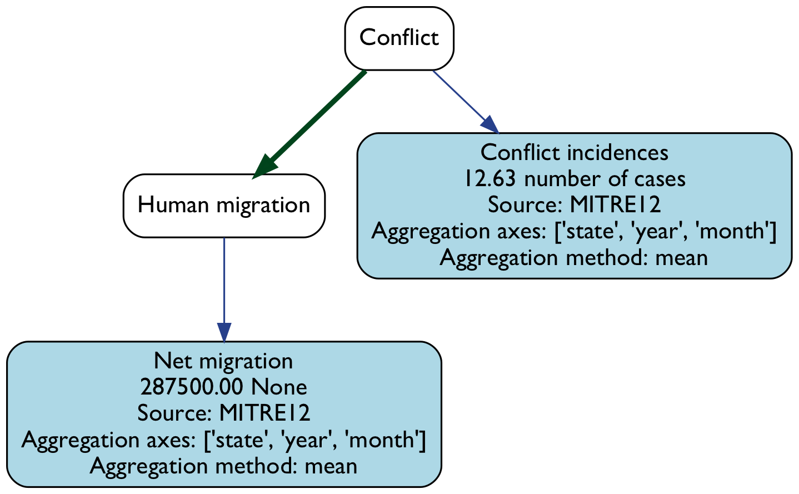
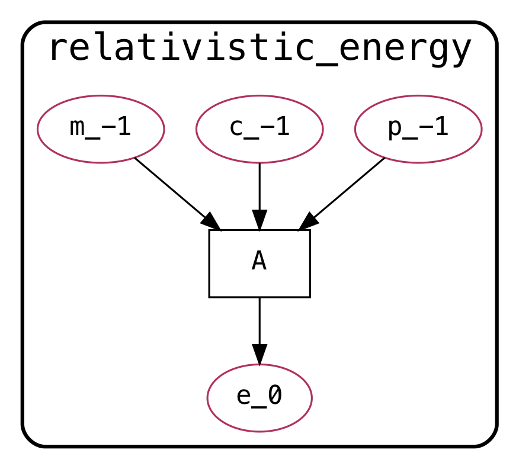

.. delphi documentation master file, created by
   sphinx-quickstart on Tue Feb  6 10:41:42 2018.
   You can adapt this file completely to your liking, but it should at least
   contain the root `toctree` directive.

Home
====

Modeling complex phenomena such as food insecurity requires reasoning
over multiple levels of abstraction and fully utilizing expert
knowledge about multiple disparate domains, ranging from the
environmental to the sociopolitical.

Delphi is a Python library (3.6+) for assembling causal, dynamic, probabilistic
models from information extracted from two sources:

- *Text*: Delphi utilizes causal relations extracted using machine
  reading from text sources such as UN agency reports, news articles,
  and technical papers.
- *Software*: Delphi also incorporates functionality to extract
  abstracted representations of scientific models from code that
  implements them, and convert these into probabilistic models.

Usage
-----

- Assembling a model from text:

.. code-block:: python

  from delphi.AnalysisGraph import AnalysisGraph

  G = AnalysisGraph.from_text(
      "Significantly increased conflict seen in South Sudan forced many"
      " families to flee in 2017.")
  G.map_concepts_to_indicators()
  G.parameterize(country="South Sudan", year=2017, month=4)
  A = G.to_agraph()
  A.draw("CAG.png", prog="dot")

- Assembling a model from Fortran code:

.. code-block:: python

  from delphi.GrFN.networks import GroundedFunctionNetwork

  G = GroundedFunctionNetwork.from_fortran_src("""\
        subroutine relativistic_energy(e, m, c, p)

        implicit none

        real e, m, c, p
        e = sqrt((p**2)*(c**2) + (m**2)*(c**4))

        return
        end subroutine relativistic_energy"""
  )
  A = G.to_agraph()
  A.draw("relativistic_energy_grfn.png", prog="dot")

Citing
------

If you use Delphi, please cite the following:

.. code-block:: bibtex

   @misc{Delphi,
       Author = {Adarsh Pyarelal and Paul Hein and Jon Stephens and Pratik
                 Bhandari and HeuiChan Lim and Saumya Debray and Clayton
                 Morrison},
       Title = {Delphi: A Framework for Assembling Causal Probabilistic 
                Models from Text and Software.},
       doi={10.5281/zenodo.1436915},
   }

Delphi builds upon `INDRA <https://indra.bio>`_ and `Eidos <https://github.com/clulab/eidos>`_.
For a detailed description of our procedure to convert text to models,
see `this document <http://vision.cs.arizona.edu/adarsh/export/Arizona_Text_to_Model_Procedure.pdf>`_.
Delphi is also part of the
`AutoMATES <https://ml4ai.github.io/automates/>`_ project.

.. toctree::
  :maxdepth: 2
  :caption: Contents:

  self
  installation
  usage
  model
  AnalysisGraph_API
  GrFN_API
  grfn_spec
  CONTRIBUTING
  cpp_api/library_root

License and Funding
-------------------

Delphi is licensed under the Apache License 2.0.

The development of Delphi was supported by the Defense Advanced Research
Projects Agency (DARPA) under the World Modelers (grant no. W911NF1810014) and
Automated Scientific Knowledge Extraction (agreement no. HR00111990011)
programs.

Indices and tables
==================

* :ref:`genindex`
* :ref:`modindex`
* :ref:`search`
