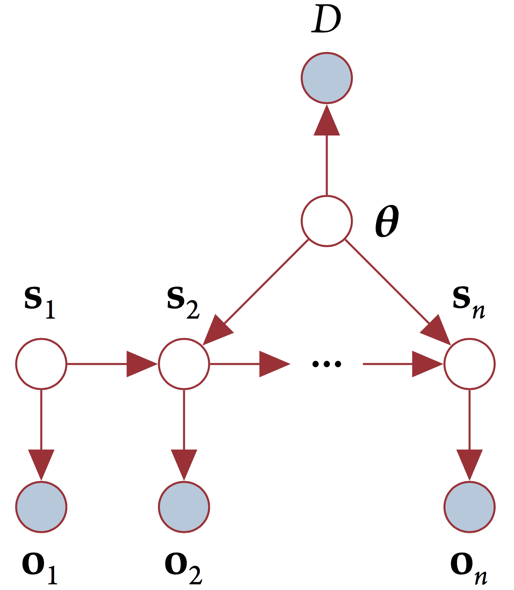

.. _model:

The Delphi model
================

We model abstract concepts such as food security and conflict as real-valued
*latent* variables, and indicators corresponding to these concepts as
*observed* variables. An indicator is a measurable quantity that correlates
with the intuitive, natural language interpretation of the abstract concept. For
example, *average dietary energy supply adequacy* is one among many indicators
for the concept of *food security*.

We interpret sentences such as "A small increase in conflict causes a large
decrease in food security." as saying something about the functional relationship
between two latent variables representing conflict and food security
respectively - that is, the sentence is giving us a clue about the shape of
:math:`\frac{∂(\text{food security})}{∂(\text{conflict})}`

To convert a sentence like the one above to a dynamic Bayes network, we first
construct latent states composed of the variables and their partial derivatives
with respect to time. In our model, the transition function that tells us how to
calculate the latent state at a time step given the latent state at the previous
time step is itself a random variable, with a probability distribution
constructed from Gaussian kernel density estimators of empirical, crowdsourced
data about how humans quantitatively interpret gradable adjectives such as
*small* and *large*. The reason for this is that there is a great deal of
uncertainty in the model itself, since there is no precise model for many
abstract concepts such as food security and conflict that we expect to encounter
in machine reading. Finally, we use the following emission model - let
:math:`n_{ij}` be the value of the :math:`j^{th}` indicator for the :math:`i^{th}`
component of a latent state vector :math:`\mathbf{s}`. We then define
probability distribution for the value of the indicator as

.. math::
  n_{ij}\sim \mathcal{N}(s_i\mu_{ij}, \sigma_{ij}).

where :math:`\mu_{ij}, \sigma_{ij}` are the mean and standard deviation of the
indicator :math:`n_{ij}`. The structure of the model is shown in the figure
below.

    function
  :width: 50 %

  The figure depicts the model that underlies Delphi - a linear dynamical system
  with a stochastic transition function. The nodes :math:`\mathbf{s}_n` are
  latent state vectors, :math:`\mathbf{\theta}` is the transition model, and
  :math:`D` represents evidence from machine reading.

For more details on the model construction, see this document_.

.. _document: http://vision.cs.arizona.edu/adarsh/Arizona_Text_to_Model_Procedure.pdf
